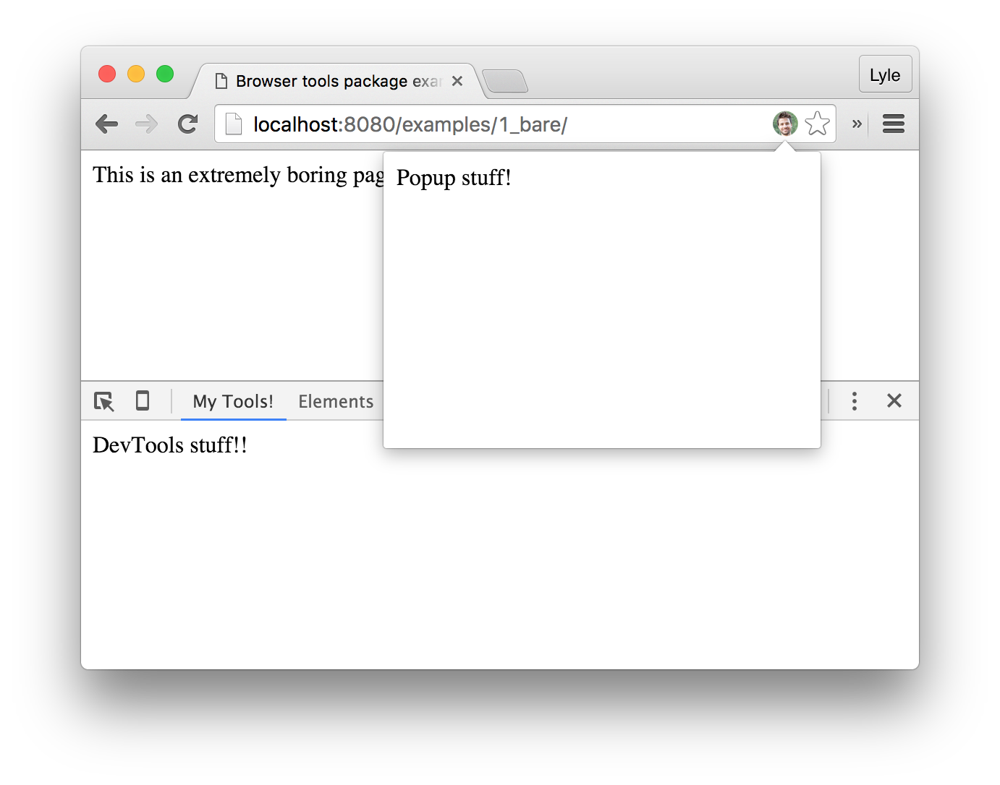
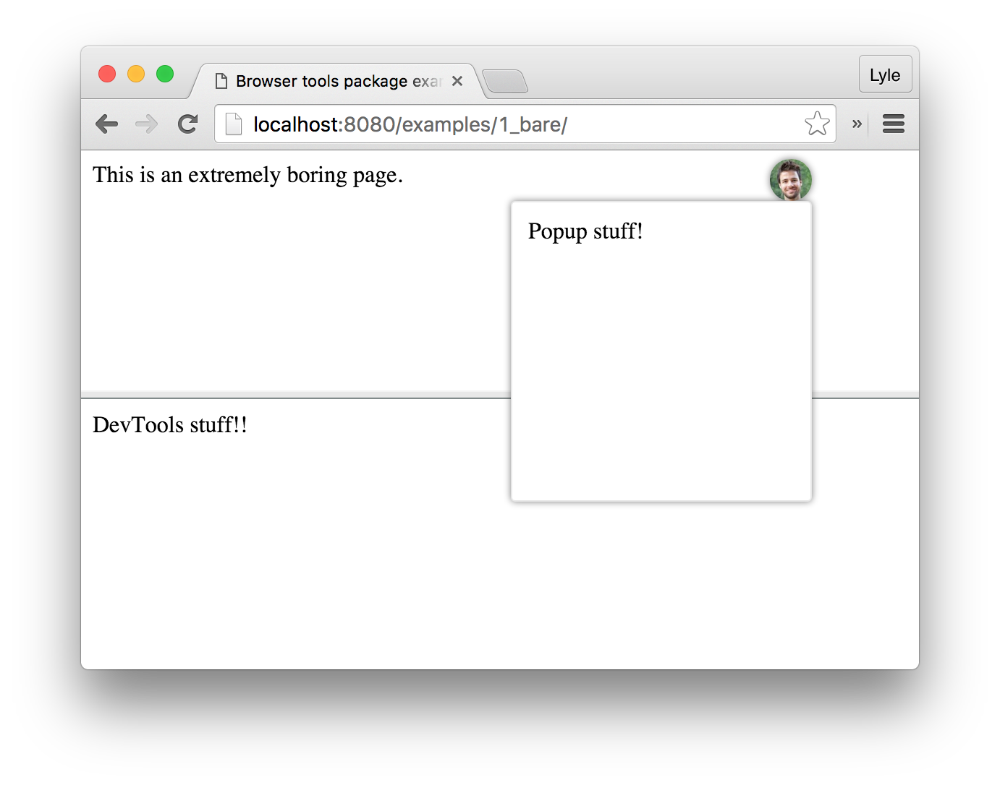

# my-custom-browser-tools
Framework for in-browser debugging and development tools.

## Purpose

This repo serves as a template for creating your own custom browser tools. It includes a base framework that can be
extended to provide custom functionality specific to your webapp. It does so by creating an interface for interacting
with features using a Chrome extension, as well as a fallback for all browsers using iframes.

Here is a visual of the core framework with no functionality added using both the Chrome extension and the iframe fallback:

**Chrome extension**

**`<iframe>` fallback**

The two main visual components—the popup and the DevTools panel—provide a blank canvas in which you can create whatever
features are helpful to you for developing, designing, testing, and supporting your own webapp or webapps. The visual components and the webapp itself are connecting via a [message passing API](docs/api) that allows all the pieces to interact without concern of the context in which they were loaded.

## Usage

Ready to start making your own tools? Here's how to adapt this template to work with your
own webapp.

1. Fork the repo.
2. Update the [messages.json](src/wrappers/chrome-extension/_locales/en/messages.json) file with your own configuration.
3. Update the [manifest.json](src/wrappers/chrome-extension/manifest.json) file's `externally_connectable.matches` field. This should match the content in `site_local_dev_hosts` and `site_host_suffixes` in `messages.json`.
4. Update the icons for the [chrome extension](src/wrappers/chrome-extension/images/icon.png) and [iframe fallback](src/wrappers/iframe/popup/icon.jpg) (keep naming the same or you'll need to update references as well).
4. Run the examples using `npm start`. This will compile the shared scripts, start a webserver, and launch the examples directory.
5. Press `Ctrl+Shift+H` or `Ctrl+Alt+H` to open the custom browser tools on an example page, or install the extension.
6. See the [getting started](docs/getting-started.md) and [API docs](docs/api) pages for more info on customizing the examples and using in your own app.

## Installing the Chrome extension
The extension can be installed directly from the file system as a developer extension.

1. Navigate to chrome://extensions/ in Chrome.
2. Ensure "Developer mode" checkbox at the top is checked.
3. Click "Load unpacked extension...".
4. Find the location of the `src/wrappers/chrome-extension` folder and open it.
5. The extension should show up in your extensions list as "My Custom Browser Tools".

## Changelog
See the [changelog](CHANGELOG.md).
